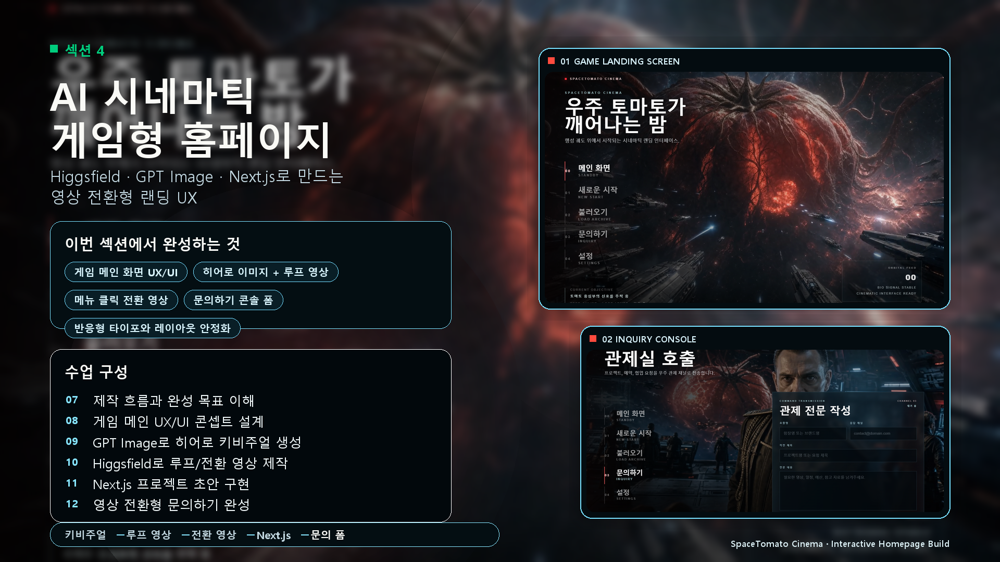
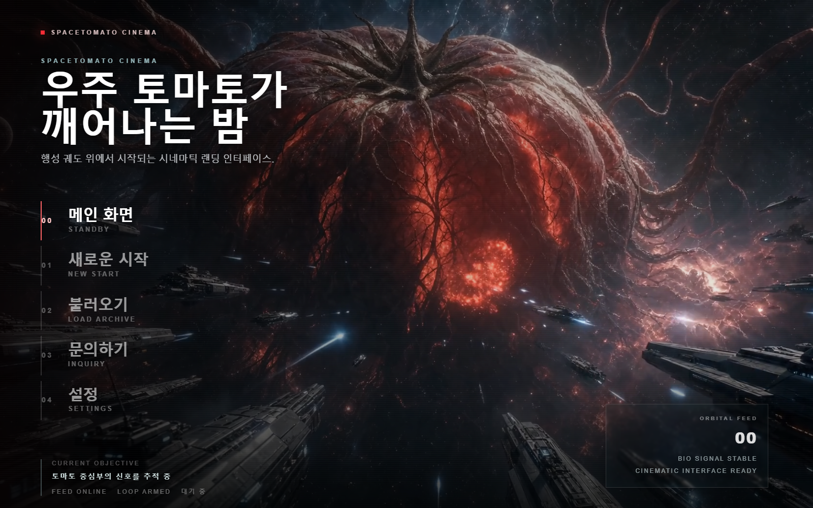
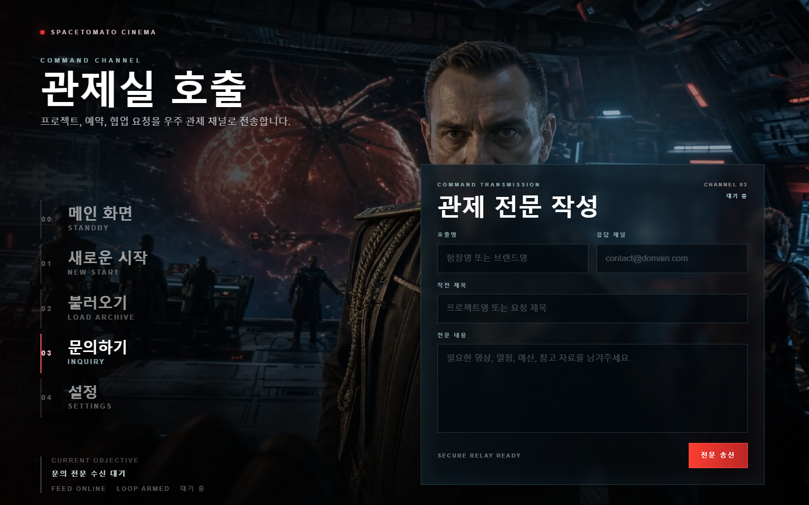

# SpaceTomato Cinema

AI 시네마틱 영상과 게임 메인 화면 UX를 결합한 Next.js 인터랙티브 홈페이지 예제입니다.  
수강생이 `GPT Image`, `Higgsfield`, `Next.js`를 이용해 키비주얼, 루프 영상, 전환 영상, 문의 폼까지 하나의 랜딩 경험으로 연결하는 흐름을 학습할 수 있도록 구성했습니다.



## 섹션 4 개요

**AI 시네마틱 게임형 홈페이지 만들기**  
Higgsfield, GPT Image, Next.js로 만드는 영상 전환형 랜딩 UX

이번 섹션에서는 일반적인 랜딩페이지 대신 콘솔 게임의 메인 메뉴처럼 동작하는 홈페이지를 만듭니다. 사용자는 왼쪽 플로팅 메뉴에서 장면을 선택하고, 메뉴 선택에 따라 전환 영상이 재생된 뒤 해당 장면의 루프 영상과 UI가 이어집니다.

## 완성 결과

### 1. 게임형 메인 랜딩 화면

히어로 이미지를 첫 프레임처럼 사용하고, `hero_video.mp4`를 전체 화면 배경으로 반복 재생합니다. 좌측 메뉴는 게임 메인 화면처럼 유지되며, 메뉴 진입 후에는 화면 몰입을 위해 자동으로 투명도가 낮아집니다.



### 2. 영상 전환형 문의하기 화면

`문의하기` 메뉴를 누르면 `move_inquiry.mp4` 전환 영상이 먼저 재생됩니다. 영상이 끝나면 관제실 콘셉트의 `inquiry_background.mp4`가 루프 배경으로 재생되고, 오른쪽에는 문의 콘솔 폼이 나타납니다.



## 수업 구성

| 차시 | 수업 제목 | 핵심 내용 |
| --- | --- | --- |
| 07 | 제작 흐름과 완성 목표 이해 | 전체 결과물, 필요한 이미지/영상 자산, 제작 파이프라인 파악 |
| 08 | 게임 메인 UX/UI 콘셉트 설계 | 콘솔 게임식 메뉴 구조, 플로팅 메뉴, 장면 전환 UX 설계 |
| 09 | GPT Image로 히어로 키비주얼 생성 | 우주 토마토 콘셉트의 시네마틱 첫 프레임 제작 |
| 10 | Higgsfield로 루프/전환 영상 제작 | 히어로 루프 영상, 문의하기 이동 영상, 문의 배경 영상 제작 |
| 11 | Next.js 프로젝트 초안 구현 | App Router, Tailwind CSS, 풀스크린 비디오 배경, 반응형 메뉴 구현 |
| 12 | 영상 전환형 문의하기 완성 | 전환 영상 재생, 루프 배경 교체, 문의 콘솔 폼, 깜빡임 제거 |

## 구현 포인트

- 최신 Next.js `16.2.4` 기반 App Router 프로젝트
- 전체 화면 비디오 배경과 poster 이미지 연결
- 메뉴 클릭 시 장면별 텍스트, 목표, 루프 영상 전환
- `문의하기` 진입 시 전환 영상 재생 후 문의 배경 루프 유지
- 전환 영상 첫 프레임 로드 전까지 투명 처리해 순간 깜빡임 방지
- 상단 카피 영역 고정으로 메뉴 위치가 흔들리는 레이아웃 시프트 방지
- 큰 모니터에서 게임 UI처럼 단계적으로 커지는 반응형 타이포
- 관제실 콘셉트의 문의 폼 UI

## 주요 파일

```text
src/app/page.tsx
src/app/globals.css
public/media/hero_image.png
public/media/hero_video.mp4
public/media/move_inquiry.mp4
public/media/inquiry_background.mp4
public/media/inquiry_end_frame.png
output/course-section-4-overview.png
output/playwright/home-main.png
output/playwright/inquiry-console.png
```

## 실행 방법

```bash
npm install
npm run dev
```

브라우저에서 [http://127.0.0.1:3000](http://127.0.0.1:3000)을 열면 됩니다.

## 검증

```bash
npm run lint
npm run build
```

현재 프로젝트는 위 두 명령을 기준으로 검증했습니다.
